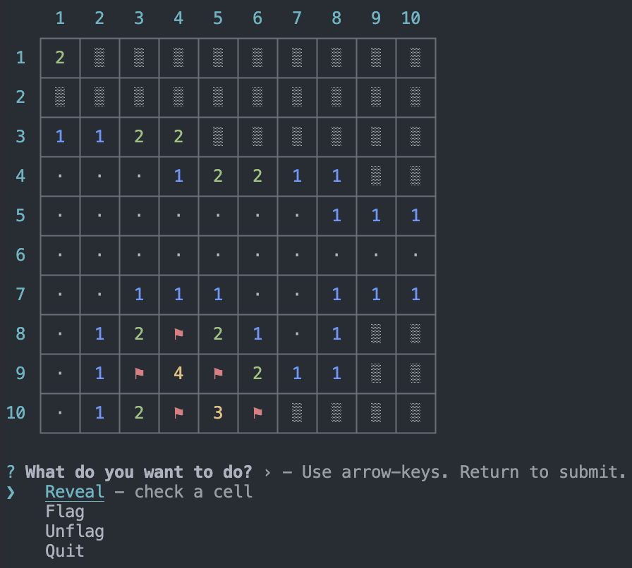

# Minesweeper

A simple version of the classic game [minesweeper](https://en.wikipedia.org/wiki/Minesweeper_(video_game))
that can be run from the terminal. Written in TypeScript.



## Running

```sh
npm install
npm start
```

## Options

```sh
> npm start -- [opts]

-r, --rows  <n>    (default: 10)
-c, --cols  <n>    (default: 10)
-m, --mines <n>    (default: 15%)
-h, --help
```

## License

MIT
